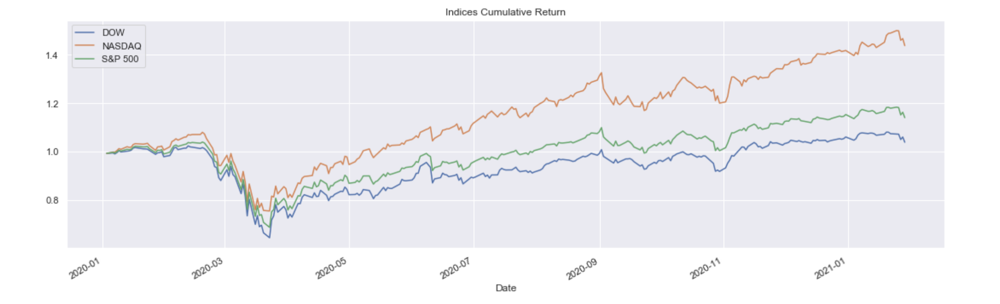
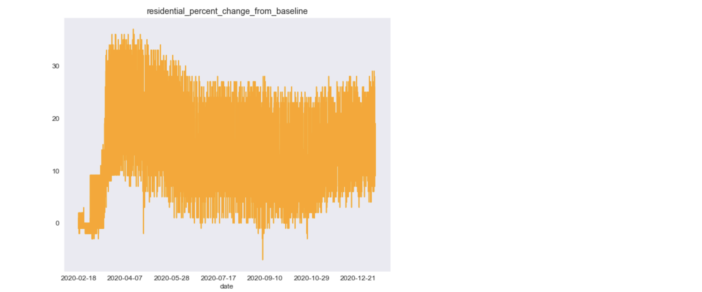
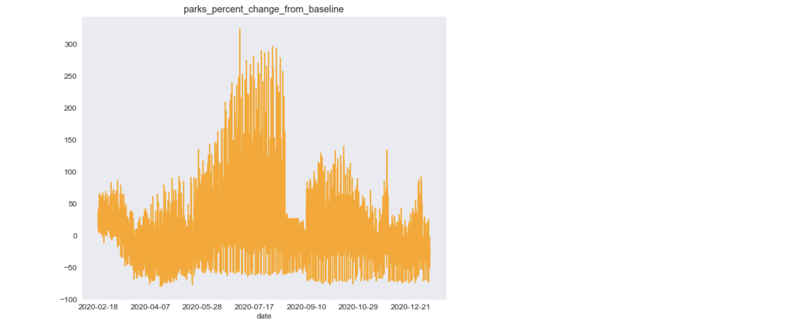
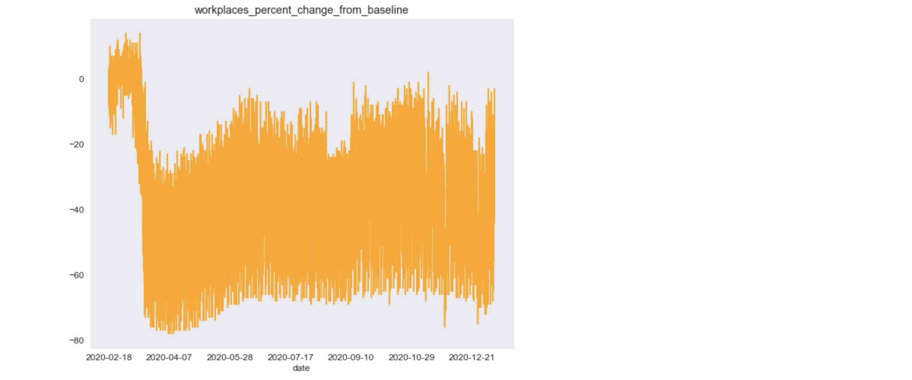
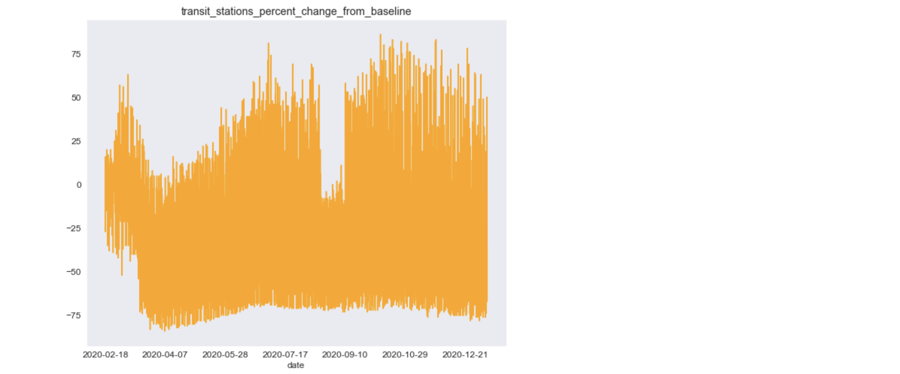

# Exploration of COVID-19's Impact on U.S. Economy

## Tools Used 
Python, Google BigQuery, Scikit-learn, NumPy, Pandas, Matplotlib, Bokeh

## Introduction
This was an exploratory project to understand the impact of COVID on the stock market and mobility of Google Maps consumers. 

### 1) Perform Exploratory Data Analysis on U.S. stock market to compare the impact COVID-19 has had on major indices.

#### COVID-10 cases and deaths cross on 12/20

#### Cumulative returns across Dow, S&P and Nasdaq drop on 04/20

#### Historical pandemics relative to COVID

### 2) Analyze Google Sector Mobility Data and visualize how mobility trends have changed relative to the baseline as a result of social distancing policies. 

#### Activity increased in residential and parks, and decreased in workplaces and transit

